## О чем мы сегодня?

- Поговорим о том, как __правильно__ хранить свои исходники
- Что такое __VCS__, и какие они бывают
- Почему __GIT__ и с чем его есть?
- Создадим первый репозиторий
- Завалимся в репозиторий Лямбды

## VCS - Version Control System

Три самые популярные платформы VCS:

1. SVN
2. Mercurial
3. Git

## SVN

- __централизованная__ открытая VCS
- `svnserve` - серверная часть, в которой хранятся исходники
- `svn` - клиентская часть, в которой программисты трудятся над кодом
- когда код готов, он отправляется на серверную часть, где сливается с предшествующей версией

## Mercurial

- __децентрализованая__ VCS
- хранит данные об изменении каждого файла

## Git

- __децентрализованная__ VCS
- хранит общие изменения всего репозитория
- гибкая система ветвления
- возможность сохранять изменения без доступа к интернету
- каждый программист клонирует не _копию_, а __полноценную__ версию репозитория

## Платформы для Git-репозиториев (SaaS)

### Github

- Самое популярное решение для open-source проектов
- Сколько угодно открытых репозиториев
- Приватные репозитории (если только вы не на территории Крыма)
- Объединение в организации ([@lambdafrela](https://github.com/lambdafrela))
- Интеграция с множеством сторонних сервисов - Slack, Trello, Travis CI, etc.
- Поддержка GIT, SVN, Hg и TFS

### Gitlab

- Сколько угодно открытых репозиториев
- Сколько угодно приватных репозиториев
- Объединение в организации
- Гибкая настройка прав доступа
- Вобственный сервис _continous integration_
- Можно запускать на своем сервере

### Bitbucket

- Сколько угодно открытых репозиториев
- Сколько угодно приватных репозиториев
- Объединение в организации
- Собственные клиенты на ПК и Android
- Интеграция с enterprise-сервисами Atlassian - Jira, etc.

## Создадим первый репозиторий

### Итак, с чего же начать?

Дадим системе понять, кто мы такие:

1. `git config --global user.name "John Doe"`
2. `git config --global user.email foo@citrix.com`

## Создадим проект

1. Создадим папку с нашим будущим проектом `mkdir myfirstrepo`
2. Зайдем в папку `cd myfirstrepo`
3. Инициализируем репозиторий  
   `git init`

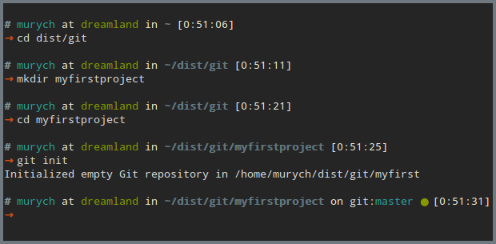

### Создадим в нем пустой файл и добавим в него текст

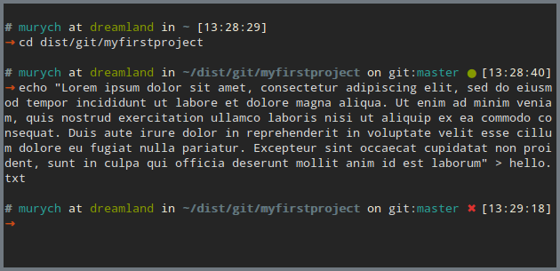

### Немного о структуре репозитория

Любой git-репозиторий состоит из трех "деревьев", в которых хранятся изменения:

- `working directory` - рабочая папка, в которой содержатся файлы в отредактированном виде
- `Index` - выступает в роли "временного фиксатора"
- `HEAD` - файлы находятся в состоянии последнего сделанного коммита

### Посмотрим, что стало с нашим репозиторием

`git status`

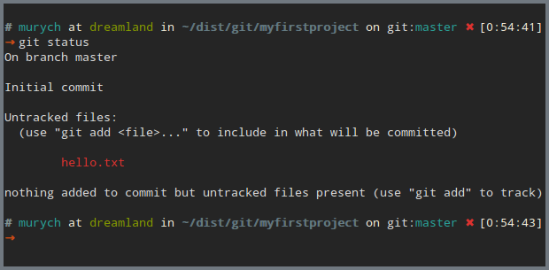

### Добавим наш новый файл в `Index`

`git add .`

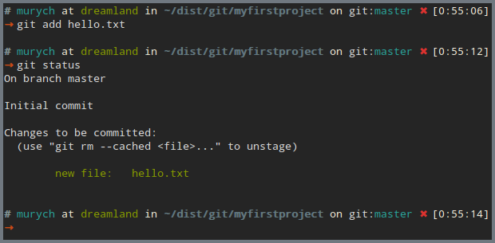

- Ппоговорим о том, как __правильно__ хранить свои исходники

### Создадим __commit__ (отпечаток) наших изменений, добавив наш файл в `HEAD`

`git commit -m "my first commit"`

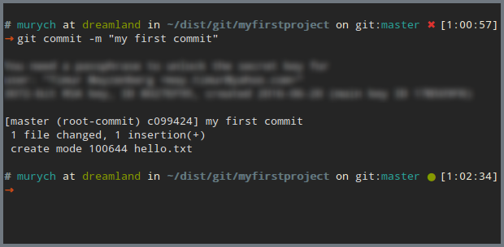

## Использование Github как хостинг для репозитория

### Создадим репозиторий на Github

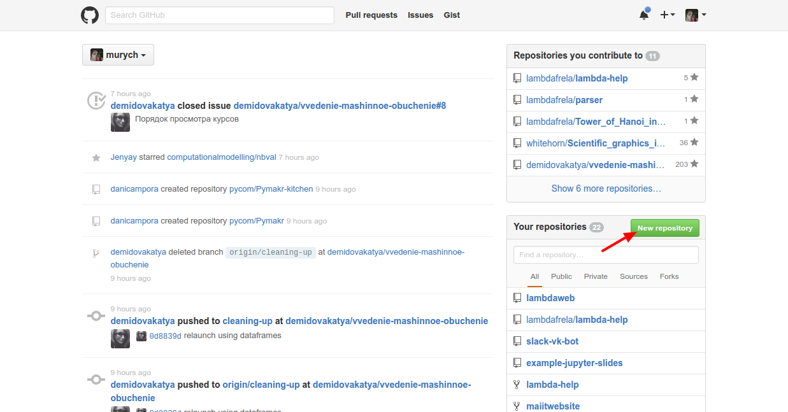

### Создадим репозиторий на Github

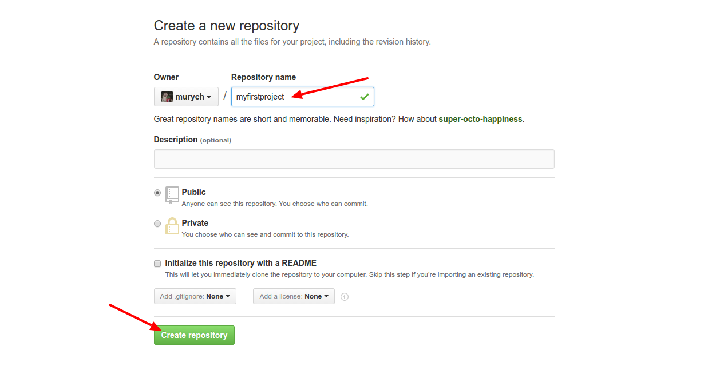

### Создадим репозиторий на Github

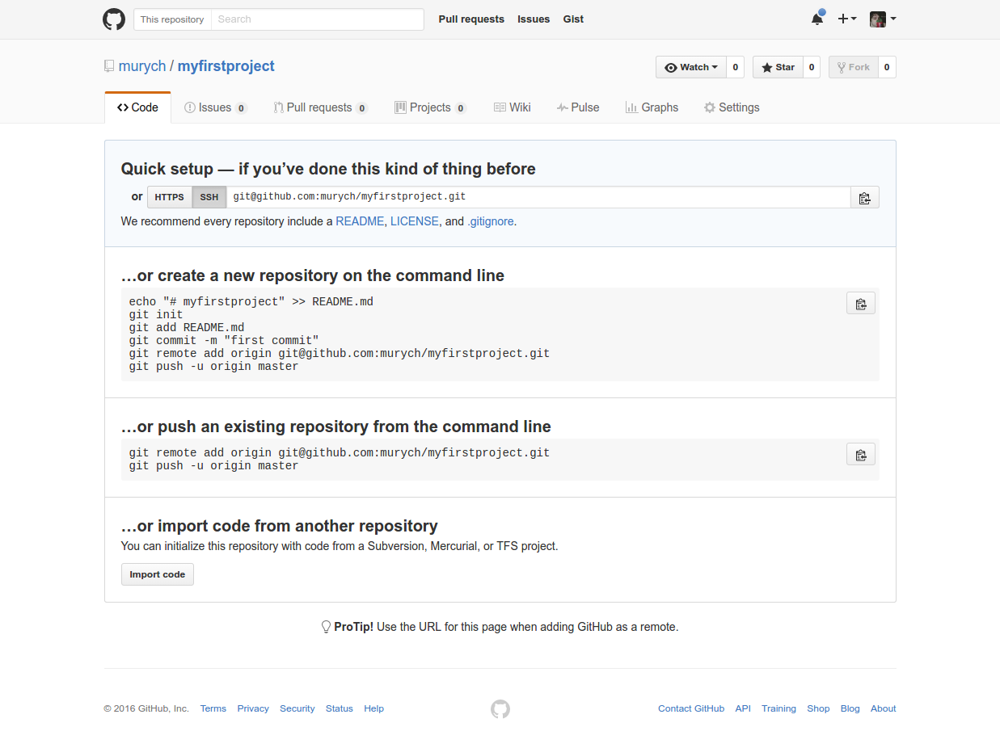

### Сделаем наш локальный репозиторий общедоступным

Поступим, как нам советуют на Github, в случае, если репозиторий уже существует:

- Добавим _remote_ по имени _origin_, т.е. путь к серверу, на котором будет храниться код  
  `git remote add origin https://github.com/murych/myfirstproject.git`
- Зальем наш код в _remote_ в ветку _master_  
  `git push -u origin master`
- Введем логин и пароль

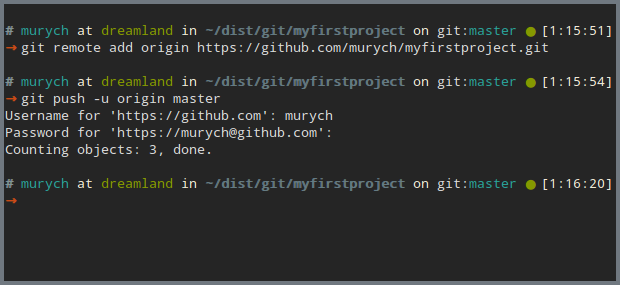

### voila~

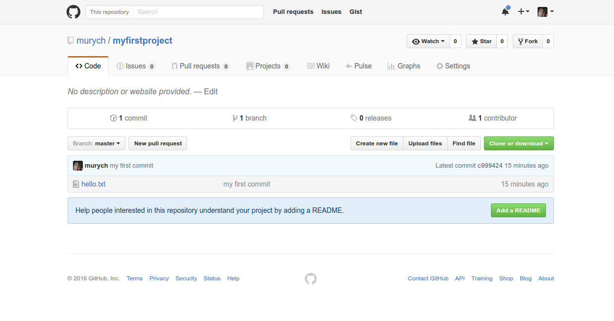

### voila~

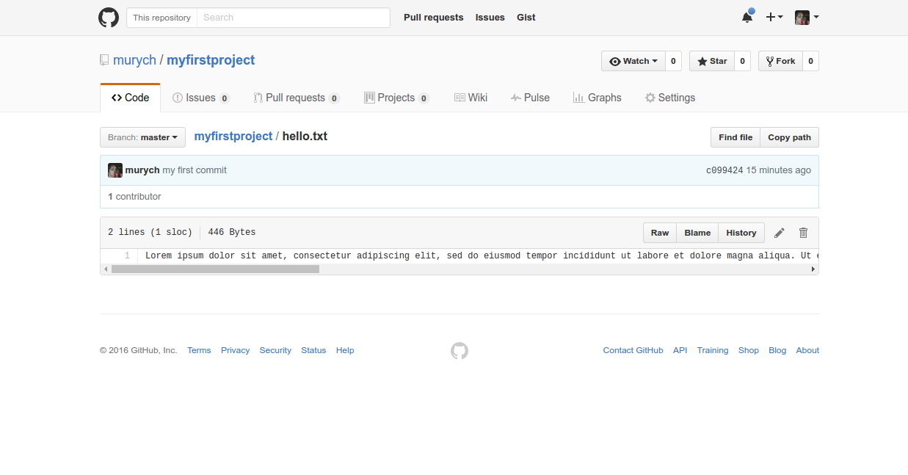

## Принимаем участие в "разработке" чужих проектов

А теперь - немного практики! Найдем репозиторий нашего сообщества, сохраним себе, и даже внесем небольшой вклад в общее
дело!

- заходим на [Github](https://github.com/) и ищем пользователя `lambdafrela`

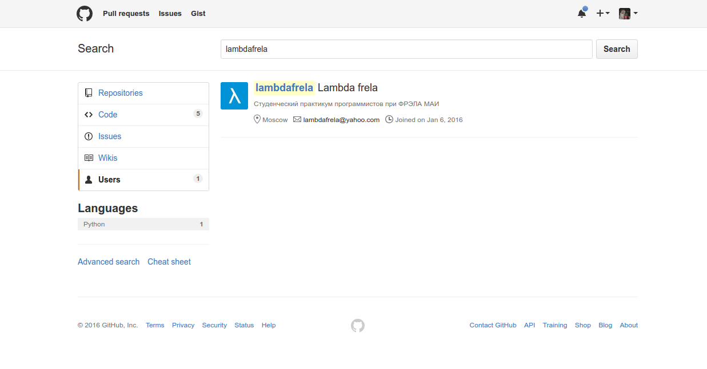

- выбираем **репозиторий** `myfirstproject` и создадем **форк** репозитория, т.е. вашу личную его копию, над которой вы
  имеете полную власть

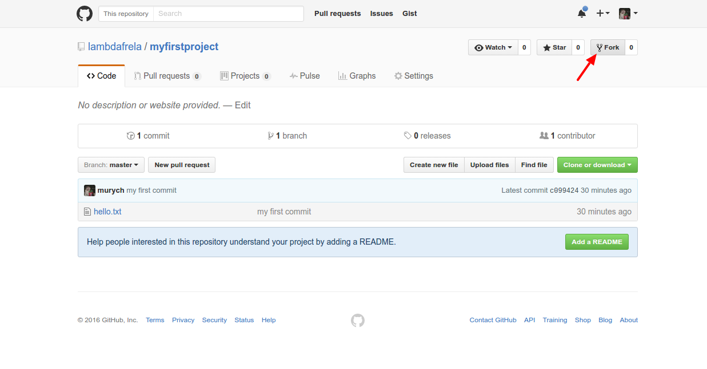

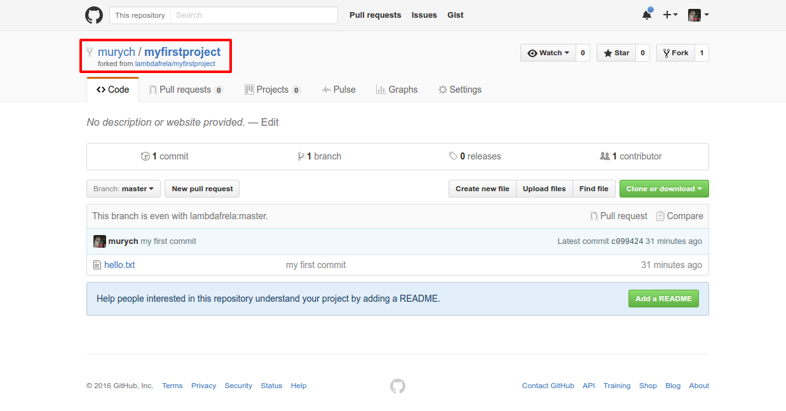

- склонируем репозиторий на свой компьютер  
  `git clone https://github.com/murych/myfirstproject.git`

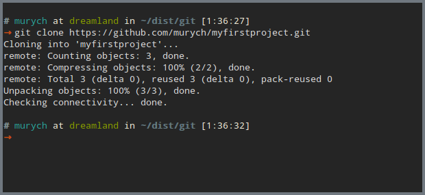

- создадим файл под названием `ваше_имя.txt`, в который запишем ваш email

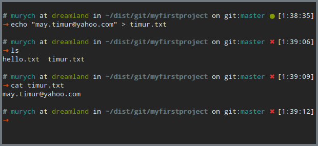

- сделаем коммит и запушим изменения в форк

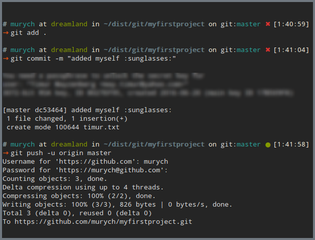

- теперь, когда наши изменения есть в форке, мы можем сделать запрос на добавление их в исходный репозиторий __Pull
  Request__

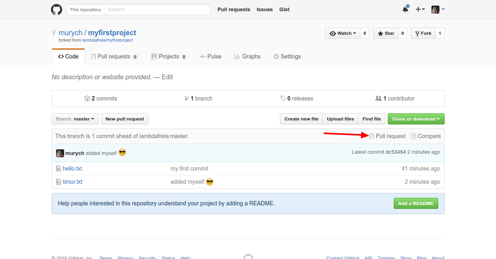

- в поле _base fork_ укажем __исходный__ репозиторий
- в поле _head fork_ укажем свой форк
- нажмем на кнопку __Create pull request__

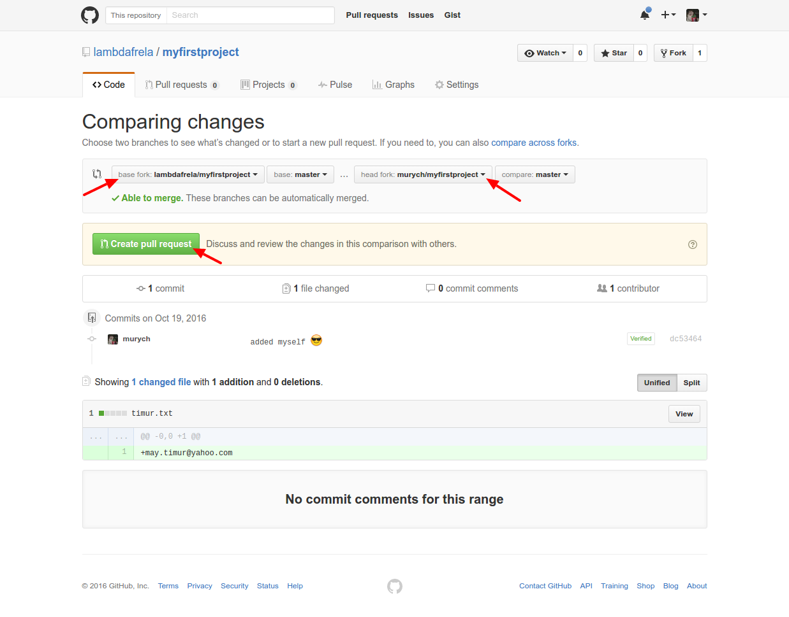

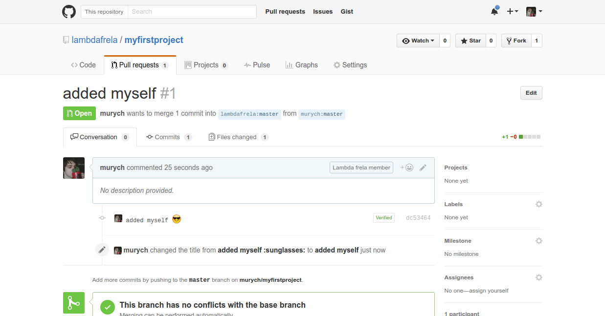

## все, кто сделают свой __Pull request__, станут участниками @lambdafrela на Github

## домашнее задание

Возьмите любой свой проект, создайте для него репозиторий на github и залейте в него код своего проекта.

Если очень хочется приватных репозиториев - для
студентов [бесплатно](https://education.github.com/) (https://education.github.com/)

## что в следующий раз?

- ближе познакомимся со структурой git репозиториев
- научимся создавать ветки
- научимся откладывать изменения до лучших времен
- поговорим о каноничном workflow
- немного tips&tricks

Данную лекцию подготовил [Тимур Майзенберг](https://github.com/murych)
